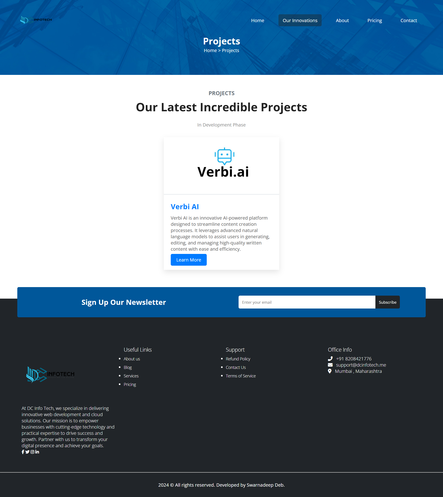

# Overview

Welcome to the project, this is a visually engaging static website. This project includes an HTML structure with a corresponding CSS file to style the elements and enhance the aesthetic appeal.

## Website Link

You can view the live website [here](https://swarnadeepdeb.github.io/DC-Info-Tech-Real-World-Application/).

## Screenshot

.
.
.
.
.
## Project Structure

The project consists of the following files and folders:

```
- images/          # Contains all images used in the project
- index.html       # Main HTML file for the website structure and content
- style.css        # CSS file for styling and layout
```


## Technologies Used

- **HTML**: Structure of the website.
- **CSS**: Styling and layout.
- **Google Fonts**: Fonts for a modern look, including "Poppins" for main text and "Great Vibes" for a touch of elegance.

## How to Use

1. Download or clone this repository.
2. Open the `index.html` file in any web browser.
3. Navigate through the website using the menu links.

## License

This project is licensed under the MIT License.
